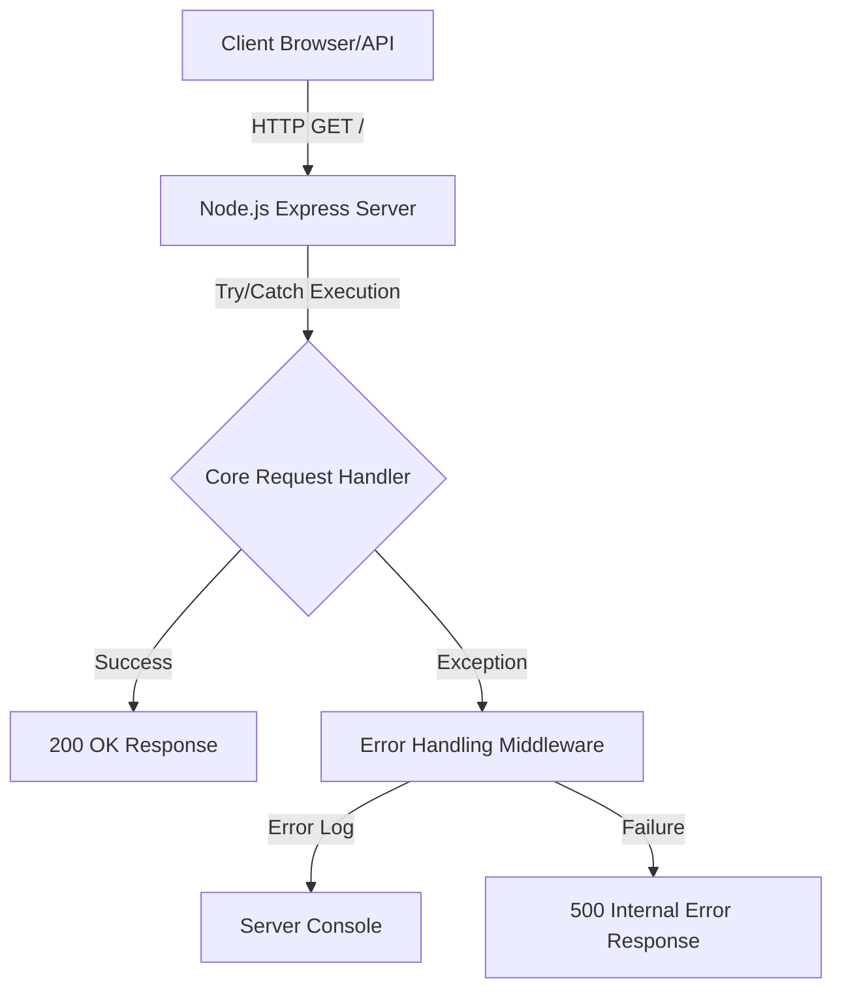

# PROJECT-HELL

This repository is built with strict enterprise engineering standards, focusing on resilient architecture, graceful error handling, and robust continuous integration.

## 🏗️ System Architecture



## 🚀 Setup Instructions

```bash
docker-compose up --build -d
```

## 📂 Structure

Following standard design patterns for a predictable layout.
- `server.js`: Main application entrypoint with robust error handling.
- `Dockerfile`: Container definition for isolated execution.
